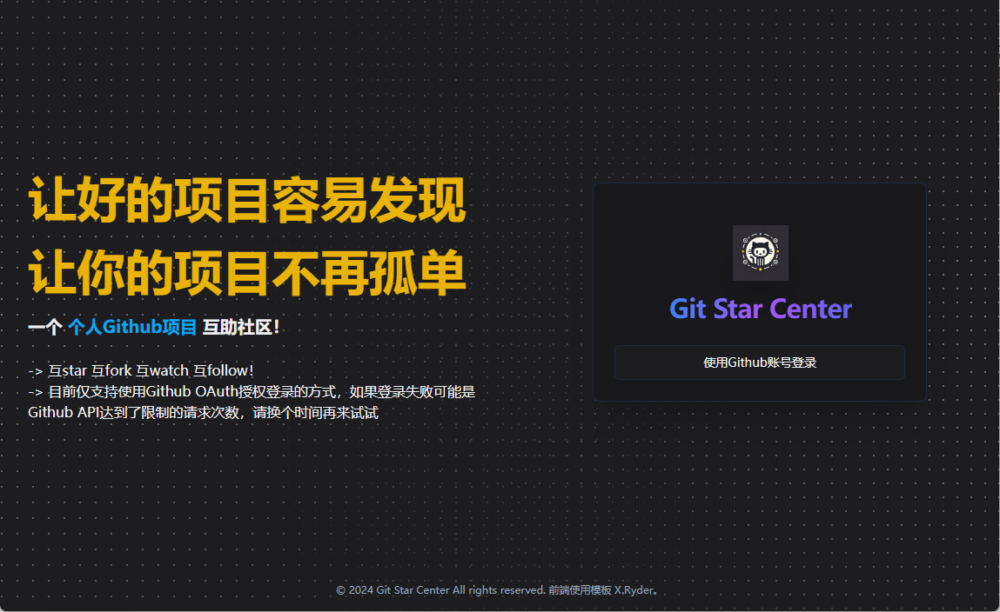
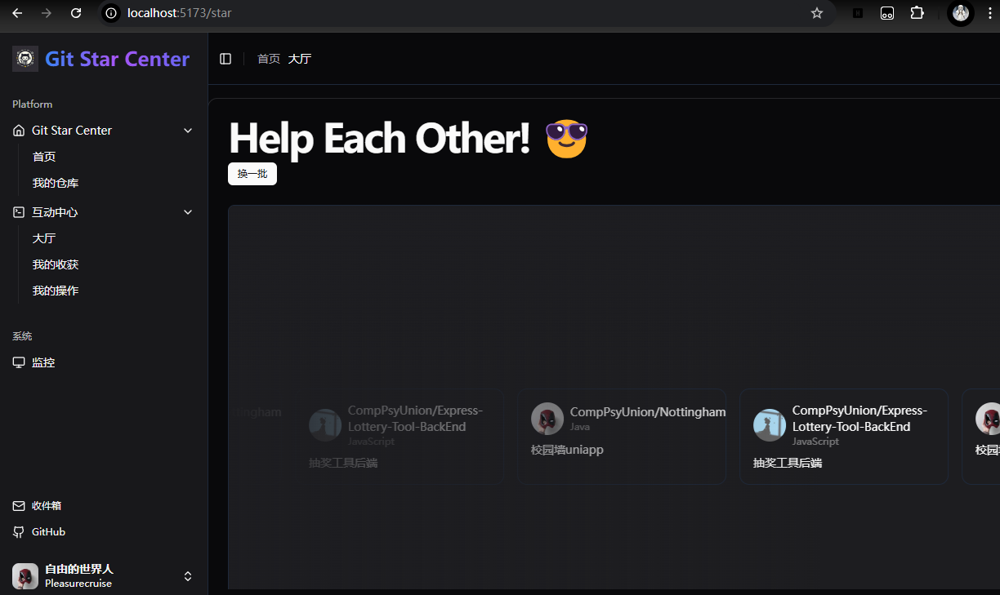
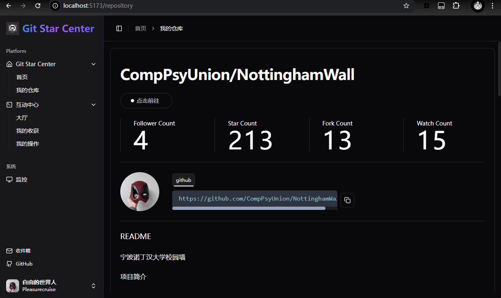
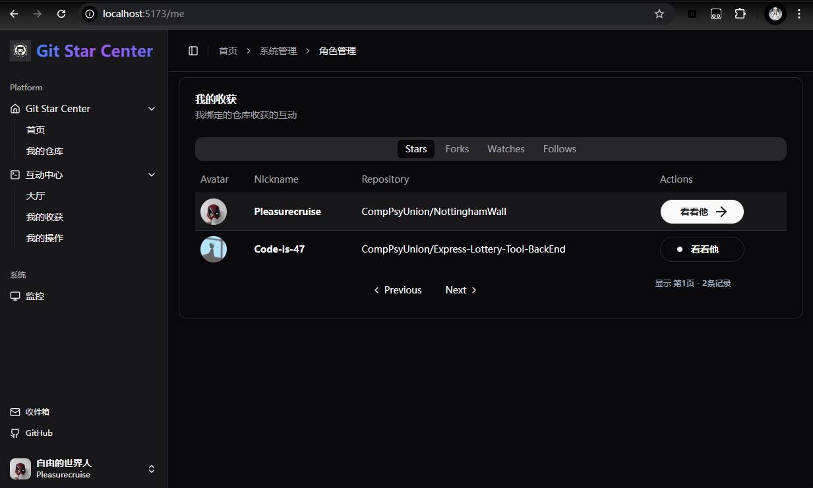

# Git Star Center

个人GitHub项目互助社区！

互star、互fork、互watch、互follow！

让好的项目容易发现，让你的项目不再孤单

**占坑开发中...**

如果你也想将你的项目置于社区主页，可以点击[这里](https://github.com/Pleasurecruise/git-star-center/blob/master/src/page/dashboard/index.tsx)直接提交PR！

如果你擅长**界面设计或者前端开发**，也欢迎加入一起完善该项目！！

## 技术栈

- 前端：
  - 框架：React
  - 网络请求：Axios
  - 路由：React Router Dom
  - 状态管理：Zustand
  - 表单验证：React Hook Form, Zod
  - 图标：React Icons, Lucide
  - UI库：Radix UI, Shadcn UI
  - 动画：Framer Motion
  - 代码检查：ESLint
  - 样式：Tailwind CSS

- 后端：
  - 框架：Spring Boot
  - 数据持久化：JPA
  - 数据库操作：MyBatis-Plus
  - 安全框架：Spring Security
  - 授权认证：OAuth2
  - 缓存：Redis
  - 日志：Slf4j

## 效果以及功能展示

|  |    |
|--------------------------------------------|---------------------------------------------|
|   |  |

## TODO

1. [ ] 评论功能
2. [ ] 标签功能
3. [ ] 搜索功能
4. [ ] 分类功能(根据主要编程语言)
5. [ ] 仓库个性化推荐
6. [ ] 社区主页设计

## 特别说明

- 本项目使用Github OAuth2进行授权认证，不会保存用户的密码等敏感信息

- 由于Github API请求速率的限制，为了避免操作失败，所以对互动操作的频率进行了限制(每小时只允许操作5次)

  请详细浏览了仓库再进行操作

- 同时，社区实行一个Github账户对应一个仓库，一旦绑定无法更改

  因为账户绑定的仓库更改后，需要更改仓库的基础数据以及和你互动过的用户数据(比如是否star)，这在没有授权的情况下是无法完成的
  
  **所以请谨慎选择需要绑定的仓库！！**

- 类似的网站还有[Github互赞吧](https://gitstar.com.cn/) 以及 [GitStarHub](https://www.gitstarhub.com/)

## 备注

- 本项目为个人项目，仅供学习参考使用，不得用于商业用途
- 本项目仍在开发中，如有问题请提交issue

## 参考项目

- [xryder-web](https://github.com/pipijoe/xryder-web)

- [spring-boot-react-oauth2-social-login-demo](https://github.com/callicoder/spring-boot-react-oauth2-social-login-demo)

